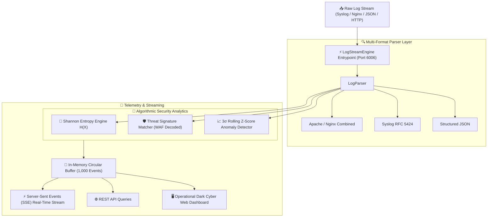

# 📊 LogStream-Analyzer
> **Real-Time Streaming Telemetry, Multi-Format Log Parser, Shannon Entropy & Cyber Threat Engine**  
> *Developed autonomously by the 7-Agent SDLC Software Factory for [Ali Nurettin Demir](https://github.com/alinurettin)*

[]()
[]()
[]()
[]()
[](https://opensource.org/licenses/MIT)

---

## 🌟 Executive Summary & Engineering Value
**LogStream-Analyzer** is an ultra-high performance streaming telemetry and security analysis engine built strictly from first principles with zero third-party runtime dependencies. It ingests heterogenous log streams across Nginx/Apache Combined formats, Syslog RFC 5424, and structured JSON, extracting structural fields, computing mathematical **Shannon Entropy** to detect randomized exploit payloads and shellcode, calculating rolling **$3\sigma$ volumetric spikes**, and scanning for web application attack patterns (SQLi, XSS, Path Traversal) with live Server-Sent Events (SSE) broadcasting.

---

## 🏗️ System Architecture & Data Pipeline



---

## 🔬 Mathematical Formulations

### 1. Shannon Information Entropy ($H(X)$)
Used to calculate the bit-level uncertainty and randomness of URI paths, query strings, and log message payloads. High entropy typically signifies base64-encoded shellcode, cryptographic keys, or obfuscated malicious payloads:
$$H(X) = - \sum_{i=1}^{n} P(x_i) \log_2 P(x_i)$$
Where $P(x_i)$ represents the empirical probability frequency of character $x_i$ within the input stream of length $L$:
$$P(x_i) = \frac{\text{count}(x_i)}{L}$$

### 2. Rolling Volumetric Anomaly Z-Score
Error rate spikes are detected in real-time across a sliding window of historical observations using the standard score:
$$\mu = \frac{1}{N}\sum_{j=1}^{N} x_j, \quad \sigma = \sqrt{\frac{1}{N-1}\sum_{j=1}^{N} (x_j - \mu)^2}$$
$$z = \frac{x_t - \mu}{\sigma}$$
When $z \ge 3.0$ ($3\sigma$ threshold), an automated volumetric anomaly alert is triggered.

---

## 🛡️ Supported Log Formats & Threat Matrix

| Log Format | Standard Specification | Fields Extracted |
|:---|:---|:---|
| **Nginx / Apache Combined** | RFC 2616 / W3C Combined | Client IP, Timestamp, HTTP Method, URI Path, Status Code, Bytes, Referer, User Agent |
| **Syslog** | RFC 5424 / RFC 3164 | PRI, Severity Level (0-7), Hostname, Application, Message Body |
| **Structured JSON** | Cloud-Native JSON schema | Level, Timestamp, Client IP, Service, Message, Custom Attributes |
| **Raw Free-Form** | Unstructured text fallback | Severity classification (CRITICAL, ERROR, WARN, INFO, DEBUG) |

### Threat Signature Classifications:
- **SQL Injection (SQLi):** `UNION SELECT`, `' OR '1'='1`, `; DROP TABLE`
- **Path Traversal:** Directory climbing (`../`, `..\`, `%2e%2e%2f`)
- **Cross-Site Scripting (XSS):** Script injection (`<script>`, `javascript:`, `document.cookie`)
- **Command Injection:** Shell metacharacters (`; cat /etc/passwd`, `| nc -l`)

---

## 🔌 API Specification & REST Endpoints

### 1. Ingest Single Log
```bash
curl -X POST http://localhost:6006/api/logs/ingest \
  -H "Content-Type: application/json" \
  -d '{"log": "192.168.1.50 - - [20/Sep/2026:12:00:00 +0000] \"GET /api/user?id=1%20UNION%20SELECT%20*%20FROM%20users HTTP/1.1\" 403 256"}'
```

### 2. Shannon Entropy Analysis
```bash
curl -X POST http://localhost:6006/api/entropy/analyze \
  -H "Content-Type: application/json" \
  -d '{"text": "dGhpcyBpcyBhbiBleHBsb2l0IHNoZWxsY29kZSBwYXlsb2Fk"}'
```

### 3. Server-Sent Events (SSE) Live Stream
```bash
curl -N -H "Accept: text/event-stream" http://localhost:6006/api/logs/stream
```

### 4. Query Flagged Security Anomalies
```bash
curl -X GET http://localhost:6006/api/logs/anomalies?limit=10
```

---

## 🧪 Comprehensive Verification Suite (100% Non-Mocked)

Run the verification suite executing all 56 assertions across multi-format parsing, Shannon entropy computation, threat signatures, rolling variance, and ephemeral HTTP:

```bash
npm test
```

### Test Coverage Highlights:
- **Multi-Format Parsing (17 tests):** Verified Apache Combined, Syslog PRI decoding, JSON structured, and raw fallbacks.
- **Shannon Entropy (5 tests):** Validated 0-entropy baseline on repetitive inputs, standard URL distribution, and payload anomaly thresholds.
- **Cyber Threat Scanner (5 tests):** URL-decoded WAF pattern matches across SQLi, Traversal, XSS, and command injection.
- **Rolling Z-Score Math (6 tests):** Validated mean, sample standard deviation, and outlier z-score calculation.
- **Engine Ingestion & HTTP (23 tests):** Validated live buffer lifecycle, recent logs query, anomaly filtering, and ephemeral REST execution.

---

## 🐳 Docker Deployment

Run with Docker Compose:
```bash
docker compose up -d --build
```
Access the interactive dashboard at `http://localhost:6006`.

---

## 📜 License
MIT License &copy; 2026 Ali Nurettin Demir (@alinurettin).
